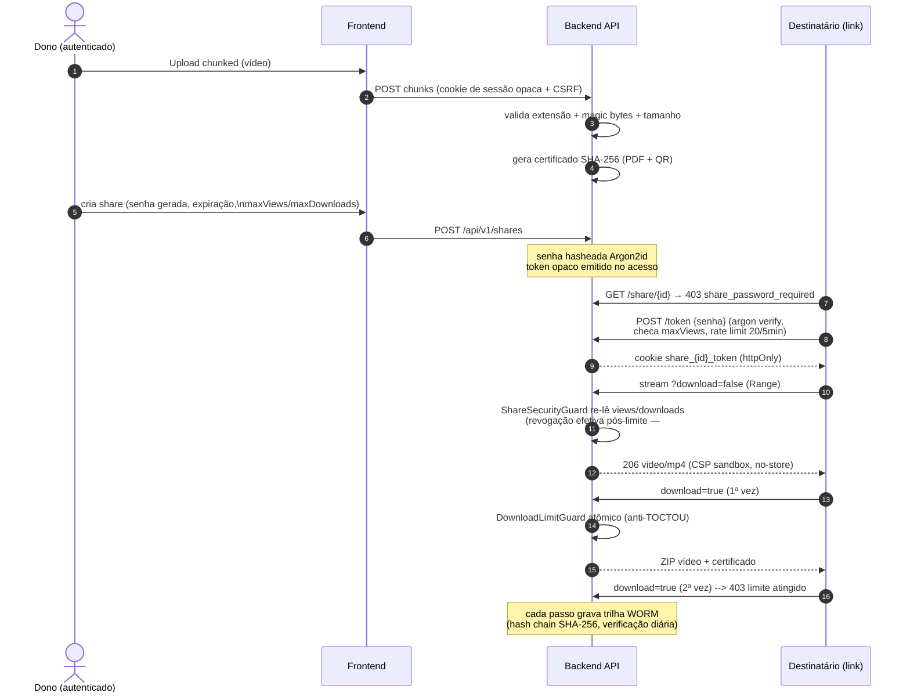
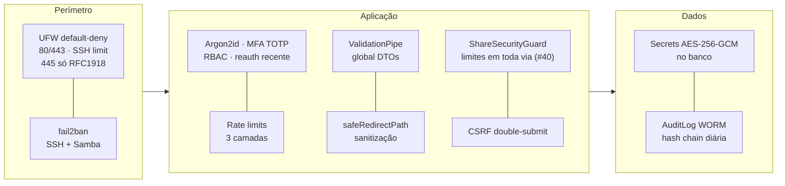

# Diagrama do Sistema — Controle Share Videos

> Renderização: GitHub exibe Mermaid nativamente. Duas visões:
> **1. Implantação (componentes)** e **2. Fluxo de compartilhamento**.

---

## 1. Visão de implantação (host on-premise)

```mermaid
flowchart TB
    subgraph LAN["Rede interna GML (RFC1918)"]
        WS["🖥️ Estação Windows\n(coleção de vídeos)"]
        U["👤 Usuários\n(admin/operador/auditor)"]
    end

    subgraph HOST["Servidor on-premise (Ubuntu + Docker + Swarm secrets)"]
        direction TB

        subgraph EDGE["Edge"]
            CADDY["Caddy :3000\nTLS automático · HSTS\ncabecalhos de segurança\nrate limit · mascara pwd= nos logs"]
        end

        subgraph APP["Aplicação"]
            FE["Next.js frontend :3333\n(PWA standalone)\nvalidação client-side"]
            BE["NestJS backend :8080\nArgon2id · sessões opacas\nCSRF · throttler · WORM audit\nAPI versionada /api/vN"]
        end

        SMB["Samba [videos] :445\nSMB3 + encrypt required\nsigning mandatory · full_audit\nveto de payload · fail2ban"]

        DB[("SQLite\ncontrole-videos.db\n+ WAL")]
        VOL[("Volume uploads/\nshares · certificados PDF")]

        subgraph MON["Monitoramento (compose.monitoring)"]
            PROM["Prometheus"]
            ALERT["Alertmanager\n→ Slack / PagerDuty"]
            GRAF["Grafana"]
            LOKI["Loki + Promtail\n(logs agregados)"]
        end

        BAK["Backups\nSQLite + uploads\n→ 2º servidor/NAS\ncifrados + restore testado"]
    end

    SMTP["SMTP institucional\n(notificações, convites,\nreset de senha)"]

    %% Tráfego principal
    U -->|HTTPS 443| CADDY
    CADDY -->|proxy /api/*| BE
    CADDY -->|páginas| FE
    WS -->|"\\\\servidor\\videos (SMB3)"| SMB

    %% Dados
    BE -->|Prisma parametrizado| DB
    BE -->|lê/escreve| VOL
    SMB -.->|bind mount setgid 1002:1002| VOL

    %% Observabilidade
    BE -->|"/api/metrics"| PROM
    LOKI <--> BE
    PROM --> ALERT
    GRAF --- PROM
    LOKI --- GRAF

    %% Integrações
    BE -->|587 TLS opcional| SMTP
    BAK -.->|cron diário| DB
    BAK -.->|rsync/rclone cifrado| VOL

    classDef edge fill:#e8f4fd,stroke:#1976d2;
    classDef app fill:#e8f8ee,stroke:#388e3c;
    classDef data fill:#fff8e1,stroke:#f9a825;
    classDef mon fill:#f3e5f5,stroke:#7b1fa2;
    class CADDY edge; FE,BE,SMB app; DB,VOL data; PROM,ALERT,GRAF,LOKI mon;
```

## 2. Fluxo do compartilhamento seguro



## 3. Camadas de segurança (resumo visual)



**Documentos relacionados:** `docs/VISAO-GERAL.md` (arquitetura textual completa) ·
`docs/GOLIVE-CHECKLIST.md` (implantação) · `docs/operacional/SAMBA-SEGURANCA.md` (SMB).
