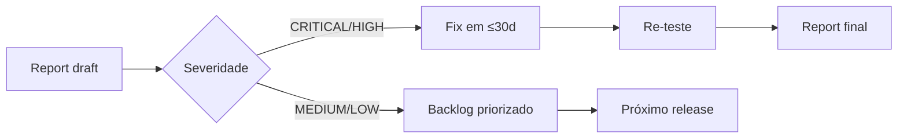

# Penetration Testing — Escopo e Contratação (SEC-4.3)

**Versão:** 1.0  
**Data:** 2026-08-21  
**Owner:** Security Lead  
**Status:** Aguardando contratação de fornecedor externo

---

## 1. Objetivo

Validação independente da postura de segurança do Controle Share Videos por
empresa certificada de pentest, com escopo **OWASP ASVS Level 2**
(aplicação que processa dados pessoais/sensíveis — adequado ao perfil do produto).

---

## 2. Escopo Técnico

### 2.1 Em escopo (staging)

| Componente | Detalhe |
|------------|---------|
| **Frontend** (Next.js) | XSS, CSRF, clickjacking, CSP bypass, PWA/SW abuse |
| **Backend API** (NestJS) | AutN/AuthZ, IDOR/BOLA, rate limit bypass, validação de input |
| **Sessões opacas** | Fixation, replay, idle/absolute timeout bypass, revogação |
| **Refresh tokens** | Rotação, detecção de reuso, hash storage |
| **MFA/TOTP + recovery codes** | Bypass, brute force de códigos, uso único |
| **Reauth crítico** | Janela, consumo single-use, endpoints protegidos |
| **Shares públicos** | Tokens opacos, expiração, revogação, senhas de share, download limits (TOCTOU) |
| **Upload/download** | Path traversal, MIME/type confusion, chunked upload abuse, ZIP handling |
| **Infra Docker/Caddy** | TLS, headers (CSP/HSTS), SSRF, container escape básico |
| **LGPD** | Exposição indevida de dados pessoais em respostas/logs |

### 2.2 Fora de escopo

- Ataques DoS/DDoS volumétricos
- Engenharia social / phishing contra funcionários
- Infraestrutura cloud subjacente (IAM, hypervisor)
- Ambiente de produção (**proibido** — apenas staging)

### 2.3 Cenários obrigatórios (validar cobertura dos testes internos)

O fornecedor deve confirmar cobertura mínima dos cenários §35.1–35.15 da spec
interna (`backend/test/security.e2e-spec.ts`), além de buscar novos caminhos.

---

## 3. Regras de Engajamento

| Item | Definição |
|------|-----------|
| Ambiente | **Staging exclusivo**, dados sintéticos (sem dados reais) |
| Janela | Combinada; sem restrição de horário dentro dela |
| Método | Black-box/grey-box (fornecer 1 conta de cada role: admin, operador, auditor) |
| Proibições | Destructive testing, exfiltração real de dados, persistência pós-teste |
| Evidências | Screenshots/PoCs permitidos; artefatos devem ser destruídos pós-relatório |
| Contato | Canal designado durante o teste (resposta < 4h para dúvidas/escopo) |
| NDA | Obrigatório antes do início |

---

## 4. Critérios de Seleção do Fornecedor

- [ ] Metodologia declarada compatível com OWASP ASVS/Testing Guide + PTES
- [ ] Certificações do time (OSCP/OSWE/CREST ou equivalente)
- [ ] Relatório com CVSS v3.1 + reprodução passo-a-passo + recomendações
- [ ] Re-teste incluído no contrato (verificação das remediações)
- [ ] Referências em aplicações similares (file-sharing/documentos)

---

## 5. Entregáveis e Prazos

| Entregável | Prazo |
|------------|-------|
| Kickoff + credenciais staging | Semana 1 |
| Execução do teste (5 dias úteis) | Semana 2 |
| Draft report | +5 dias úteis |
| Remediação CRITICAL/HIGH | ≤ 30 dias (SEC-4.3.3) |
| Re-teste de verificação | Após remediação |
| Report final assinado | Arquivado em `docs/auditoria/pentest/` |

---

## 6. Fluxo de Remediação

- Cada finding → issue GitHub com label `pentest` + severidade.
- CRITICAL/HIGH bloqueiam deploy de produção até re-teste aprovado.

---

## Checklist de Prontidão (antes do kickoff)

- [ ] Staging espelhando produção (mesma versão/config de headers)
- [ ] Contas de teste criadas nas 3 roles + dados sintéticos carregados
- [ ] Monitoramento de staging ativo (logs acessíveis ao Security Lead)
- [ ] Backup pré-teste do staging (restore rápido se necessário)
- [ ] NDA assinado + canal de contato definido
